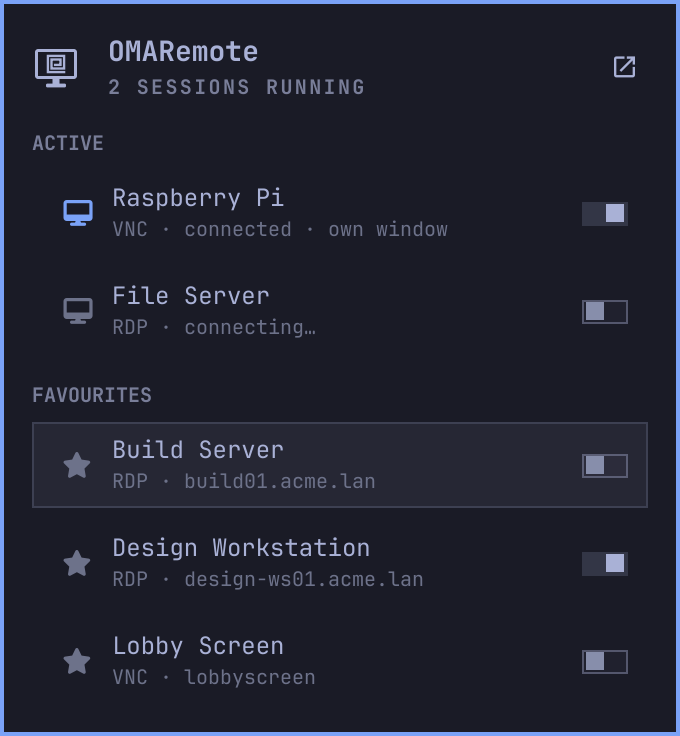

# OMARemote for the Omarchy bar

Your [OMARemote](https://github.com/RFdeGroot/OMARemote) remote desktops in the Omarchy bar.
Running sessions and favourite connections are one click away: click a running session to bring
it forward, click a favourite to connect it in a tab. OMARemote starts when it is not open yet.



## Install

```bash
omarchy plugin add https://github.com/RFdeGroot/omarchy-omaremote.git --enable
```

Then place it in the bar from Omarchy's bar settings, if it did not ask where.

Without OMARemote the panel offers to install it: *Install OMARemote* opens a terminal that
downloads the newest release for your machine (Intel/AMD or Apple Silicon) and installs it with
pacman, which also installs everything it needs. The same button updates an OMARemote that is too
old for this plugin (it needs 0.1.3-alpha or newer).

## Use

- **Active**: sessions that are connecting or connected. Click one to bring it forward.
- **Favourites**: connections starred (★) in OMARemote that are not running. Click one to connect
  it.
- **Own window**: the switch on each row (or `w`) sets where that connection opens: off, in its
  tab in OMARemote; on, in a floating window of its own on the workspace you are on. A session in
  a tab moves out of it without reconnecting, and one in its own window comes over to this
  workspace. Needs OMARemote 0.1.6-alpha or newer; with an older one the panel offers the update.
- The button at the top right opens OMARemote itself; so does a middle click on the bar icon.

| Key | In the panel |
| --- | --- |
| `j` `k`, `↓` `↑` | move |
| `⏎` | open the session or connect the favourite |
| `w` | own window for this connection: on or off |
| `o` | open OMARemote |
| `r` | refresh |
| `i` | install or update OMARemote, when it offers to |
| `esc` | close |

## Settings

**Hide the icon while OMARemote is closed and no session is running** (off by default). With it
on, the icon shows only while OMARemote is open or a session runs (sessions keep running after
the window closes). It always shows while OMARemote is missing, so it can offer to install it.

Which connections open in their own window is saved with the plugin's other settings, so it
stays as you left it, on every monitor.

## How it works

The plugin reads what OMARemote reports and does not keep state of its own:

- `omaremote --version` decides between the list and the install button;
- `omaremote-session paths` says where the connections and the session-change marker live; the
  favourites come from the connections file, the sessions from `omaremote-session list`, and both
  are watched for changes rather than polled;
- a click runs `omaremote open <connection>`, which asks the open OMARemote window (over
  Quickshell IPC) to show the session or connect, or starts OMARemote to do so; with its switch
  on for that connection, `omaremote open --window <connection>`.

## Development

```bash
node --test tests/*.test.js     # the logic: versions, which rows show, their text
omarchy plugin validate .
tests/preview.sh                # redraws preview.png from sample data, in your current theme
```

`PanelBody.qml` is the dropdown's contents, apart from the popup in `Panel.qml`, so the preview
can draw it offscreen from sample data; `Service.qml` reads OMARemote, `Model.js` holds the logic.

## License

MIT, see [LICENSE](LICENSE).
